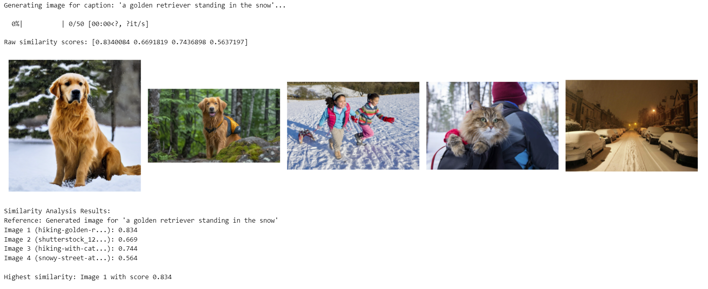

# Text-Image-Similarity-Analysis-Using-CLIP

##  Overview
This project demonstrates the use of the CLIP (Contrastive Language-Image Pretraining) model, developed by OpenAI, to compare the similarity between a text caption and multiple images. The goal is to quantify how well a given caption (e.g., "a golden retriever standing in the snow") matches a set of images by computing similarity scores based on their embeddings. The project is implemented in a Jupyter Notebook using Python, leveraging CLIP for multimodal (text and image) similarity analysis.

---

## Key Objectives

- Load and utilize the CLIP model to process text and images.
- Preprocess images and tokenize text to generate embeddings.
- Compute cosine similarity scores between text and image embeddings.
- Visualize the results by displaying images alongside their similarity scores.
- Document the findings to analyze CLIP’s performance.

---

## Example Results

The project compares the caption "a golden retriever standing in the snow" with four images, producing the following similarity scores:

- **Image 1 (hiking-golden-r...)**: 0.834
- **Image 2 (shutterstock_12...)**: 0.669
- **Image 3 (hiking-with-cat...)**: 0.744
- **Image 4 (snowy-street-at...)**: 0.564

The highest similarity score (0.834 for Image 1) indicates that this image is the most relevant to the caption.

---

## About CLIP

### What is CLIP?

CLIP (Contrastive Language-Image Pretraining) is a deep learning model developed by OpenAI that aligns images and text in a shared embedding space. Trained on a large dataset of image-text pairs (e.g., from the internet), CLIP learns to associate visual content with textual descriptions using a contrastive learning objective. This enables CLIP to perform tasks like zero-shot image classification, image retrieval, and text-image similarity matching.

### CLIP Architecture

CLIP consists of two primary components:

- **Image Encoder:**
  - Typically a Vision Transformer (e.g., ViT-B/32) or a convolutional neural network (e.g., ResNet).
  - Takes an image as input, preprocesses it (resizing, normalization), and outputs a fixed-size embedding vector (e.g., 512 dimensions for ViT-B/32).
  - The embedding captures the semantic content of the image in a high-dimensional space.

- **Text Encoder:**
  - A transformer-based model (similar to BERT or GPT architectures).
  - Takes tokenized text (e.g., a caption) as input and outputs a fixed-size embedding vector in the same dimensionality as the image embedding.
  - The embedding captures the semantic meaning of the text.

- **Shared Embedding Space:**
  - Both encoders map their inputs to a shared latent space, where embeddings of matching image-text pairs are close together, and non-matching pairs are farther apart.
  - This alignment is achieved through contrastive learning, where the model maximizes the cosine similarity for matching pairs and minimizes it for non-matching pairs.

- **Contrastive Loss:**
  - During training, CLIP uses a contrastive loss function to optimize the embeddings. For a batch of (N) image-text pairs, the model computes the similarity matrix between all images and texts, encouraging high similarity for true pairs (diagonal elements) and low similarity for false pairs (off-diagonal elements).

*Figure: Illustration of CLIP’s architecture, showing the image and text encoders feeding into a shared embedding space.*

### CLIP Workflow

The workflow for using CLIP in this project is as follows:

1. **Input Preparation:**
   - **Text**: The caption (e.g., "a golden retriever standing in the snow") is tokenized using CLIP’s tokenizer.
   - **Images**: Images are preprocessed (resized to 224x224 pixels, converted to RGB, normalized) to match the image encoder’s requirements.

2. **Embedding Generation:**
   - The tokenized caption is passed through the text encoder to produce a text embedding.
   - Each preprocessed image is passed through the image encoder to produce an image embedding.
   - Embeddings are normalized to unit length using the L2 norm: 
     - \( \text{Normalized Embedding} = \frac{\text{Embedding}}{|\text{Embedding}|_2} \)

3. **Similarity Computation:**
   - The cosine similarity between the text embedding and each image embedding is computed:
     - \( \text{Cosine Similarity} = \text{Text Embedding} \cdot \text{Image Embedding} \)
   - Since embeddings are normalized, the dot product directly yields the cosine similarity, ranging from 0 to 1 (higher values indicate greater similarity).

4. **Output:**
   - Similarity scores are collected for each image and used for ranking or visualization.

---

### Project Workflow Steps

1. **Load the CLIP Model:**
   - The CLIP model (e.g., ViT-B/32) is loaded using the transformers library from Hugging Face or OpenAI’s clip package.
   - The model is configured to run on a GPU (if available) for efficient computation.

2. **Define the Caption:**
   - A single text caption is specified (e.g., "a golden retriever standing in the snow") to serve as the reference for similarity comparison.

3. **Preprocess Images:**
   - Images are loaded using the PIL library.
   - Preprocessing steps include:
     - Resizing to 224x224 pixels.
     - Converting to RGB format.
     - Normalizing pixel values to match CLIP’s expected input range (mean and standard deviation specific to the model).

4. **Extract and Normalize Embeddings:**
   - **Image Embeddings**: Each preprocessed image is passed through the image encoder to generate a 512-dimensional embedding vector.
   - **Text Embedding**: The caption is tokenized and passed through the text encoder to generate a 512-dimensional embedding vector.
   - **Normalization**: Both embeddings are normalized to ensure unit length, enabling accurate cosine similarity computation.

5. **Compute Similarity Scores:**
   - For each image, the cosine similarity is calculated between the text embedding and the image embedding.
   - The resulting scores are stored for analysis and visualization.

6. **Visualize Results:**
   - Using matplotlib, the images are displayed in a grid, with each image labeled by its filename and similarity score.
   - This visual representation helps identify which images best match the caption.

## Visualizations

*Figure: Output from the Jupyter Notebook, displaying images with their similarity scores for the caption "a golden retriever standing in the snow".*

---

## Findings and Analysis

### Results

- **Highest Similarity**: *Image 1 (hiking-golden-r...)* scored **0.834**, indicating it closely matches the caption **"a golden retriever standing in the snow"**. This suggests the image likely depicts a golden retriever in a snowy environment.

- **Lower Scores**: *Image 4 (snowy-street-at...)* scored **0.564**, likely due to the absence of a golden retriever, making it less relevant.

- **Model Performance**: CLIP accurately ranks images based on their relevance to the caption, demonstrating its ability to capture semantic relationships.

### Observations

- CLIP effectively distinguishes between relevant and irrelevant images.
- The model’s performance depends on the quality and clarity of the images and caption.
- Edge cases (e.g., low-resolution images or ambiguous captions) may reduce accuracy.

### Potential Improvements

- Test with a larger and more diverse image set to evaluate robustness.
- Experiment with other CLIP variants (e.g., **ViT-L/14**) for improved accuracy.
- Optimize preprocessing for challenging images (e.g., low contrast or partial occlusions).

### Future Work

- **Larger Dataset**: Include more images to test CLIP’s generalization across diverse scenarios.
- **Fine-Tuning**: Fine-tune CLIP on a domain-specific dataset (e.g., pet images) for enhanced performance.
- **Interactive Tool**: Build a web interface (e.g., using **Streamlit**) for users to upload images and input captions.
- **Efficient Storage**: Implement a database or vector store (e.g., **Faiss**) for storing and querying embeddings.
